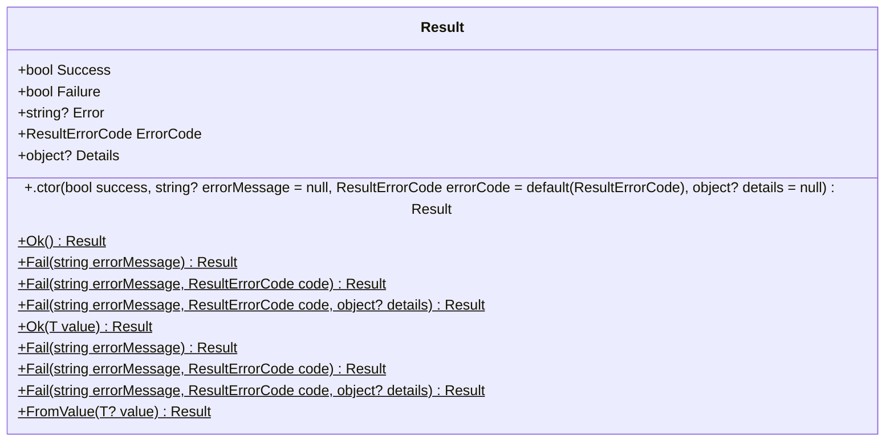
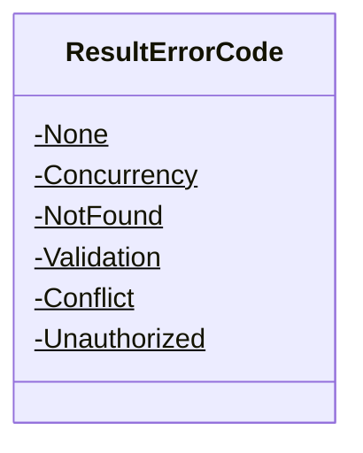
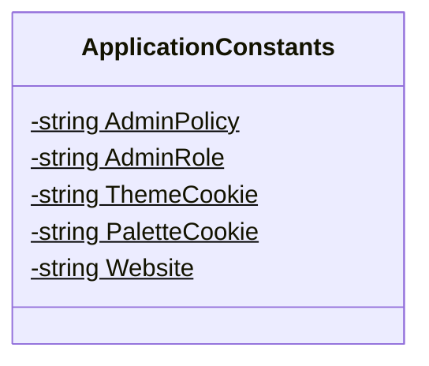
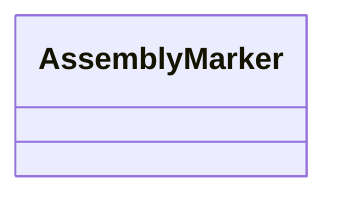
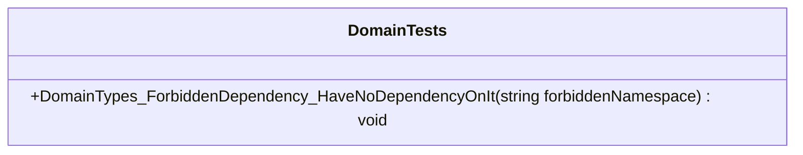
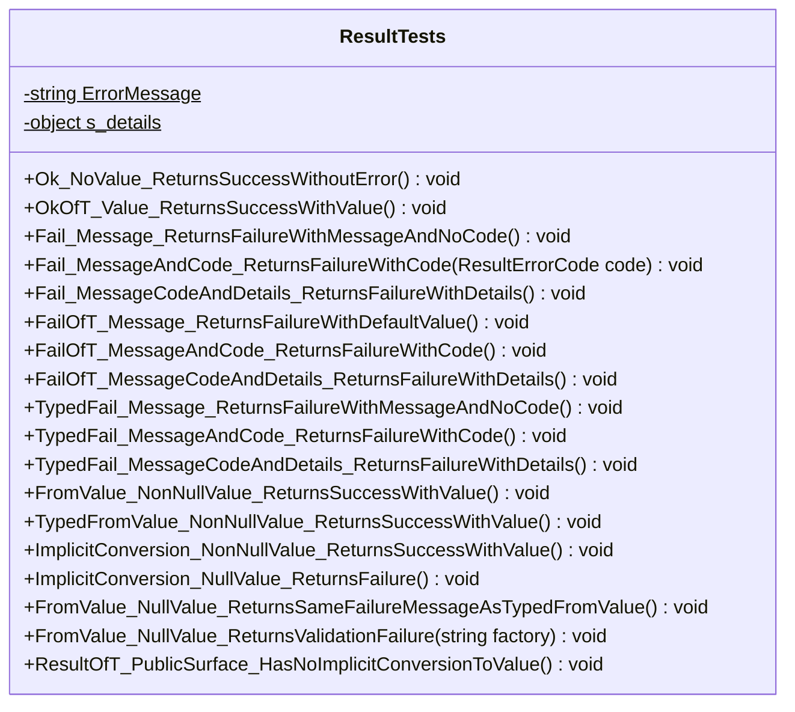
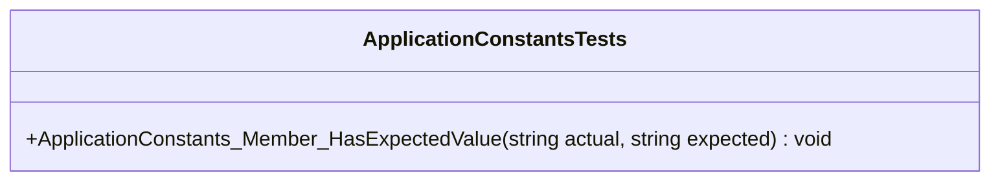

<!-- markdownlint-capture -->
<!-- markdownlint-disable -->

# Code Metrics

This file is dynamically maintained by a bot, *please do not* edit this by hand. It represents various [code metrics](https://aka.ms/dotnet/code-metrics), such as cyclomatic complexity, maintainability index, and so on.

<div id='domain'></div>

## Domain :heavy_check_mark:

The *Domain.csproj* project file contains:

- 3 namespaces.
- 5 named types.
- 338 total lines of source code.
- Approximately 35 lines of executable code.
- The highest cyclomatic complexity is 2 :heavy_check_mark:.

<details>
<summary>
  <strong id="domain-abstractions">
    Domain.Abstractions :heavy_check_mark:
  </strong>
</summary>
<br>

The `Domain.Abstractions` namespace contains 3 named types.

- 3 named types.
- 286 total lines of source code.
- Approximately 33 lines of executable code.
- The highest cyclomatic complexity is 2 :heavy_check_mark:.

<details>
<summary>
  <strong id="result">
    Result :heavy_check_mark:
  </strong>
</summary>
<br>

- The `Result` contains 15 members.
- 146 total lines of source code.
- Approximately 18 lines of executable code.
- The highest cyclomatic complexity is 2 :heavy_check_mark:.

| Member kind | Line number | Maintainability index | Cyclomatic complexity | Depth of inheritance | Class coupling | Lines of source / executable code |
| :-: | :-: | :-: | :-: | :-: | :-: | :-: |
| Method | <a href='https://github.com/mpaulosky/Blazor-Server/blob/main/src/Domain/Abstractions/Result.cs#L62' title='Result.Result(bool success, string? errorMessage = null, ResultErrorCode errorCode = default(ResultErrorCode), object? details = null)'>62</a> | 65 | 1 :heavy_check_mark: | 0 | 2 | 15 / 7 |
| Property | <a href='https://github.com/mpaulosky/Blazor-Server/blob/main/src/Domain/Abstractions/Result.cs#L94' title='object? Result.Details'>94</a> | 100 | 1 :heavy_check_mark: | 0 | 1 | 4 / 0 |
| Property | <a href='https://github.com/mpaulosky/Blazor-Server/blob/main/src/Domain/Abstractions/Result.cs#L84' title='string? Result.Error'>84</a> | 100 | 1 :heavy_check_mark: | 0 | 1 | 4 / 0 |
| Property | <a href='https://github.com/mpaulosky/Blazor-Server/blob/main/src/Domain/Abstractions/Result.cs#L89' title='ResultErrorCode Result.ErrorCode'>89</a> | 100 | 1 :heavy_check_mark: | 0 | 1 | 4 / 0 |
| Method | <a href='https://github.com/mpaulosky/Blazor-Server/blob/main/src/Domain/Abstractions/Result.cs#L110' title='Result Result.Fail(string errorMessage)'>110</a> | 97 | 1 :heavy_check_mark: | 0 | 0 | 9 / 1 |
| Method | <a href='https://github.com/mpaulosky/Blazor-Server/blob/main/src/Domain/Abstractions/Result.cs#L121' title='Result Result.Fail(string errorMessage, ResultErrorCode code)'>121</a> | 94 | 1 :heavy_check_mark: | 0 | 1 | 10 / 1 |
| Method | <a href='https://github.com/mpaulosky/Blazor-Server/blob/main/src/Domain/Abstractions/Result.cs#L133' title='Result Result.Fail(string errorMessage, ResultErrorCode code, object? details)'>133</a> | 93 | 1 :heavy_check_mark: | 0 | 2 | 11 / 1 |
| Method | <a href='https://github.com/mpaulosky/Blazor-Server/blob/main/src/Domain/Abstractions/Result.cs#L155' title='Result<T> Result.Fail<T>(string errorMessage)'>155</a> | 97 | 1 :heavy_check_mark: | 0 | 1 | 10 / 1 |
| Method | <a href='https://github.com/mpaulosky/Blazor-Server/blob/main/src/Domain/Abstractions/Result.cs#L167' title='Result<T> Result.Fail<T>(string errorMessage, ResultErrorCode code)'>167</a> | 94 | 1 :heavy_check_mark: | 0 | 2 | 11 / 1 |
| Method | <a href='https://github.com/mpaulosky/Blazor-Server/blob/main/src/Domain/Abstractions/Result.cs#L180' title='Result<T> Result.Fail<T>(string errorMessage, ResultErrorCode code, object? details)'>180</a> | 93 | 1 :heavy_check_mark: | 0 | 3 | 12 / 1 |
| Property | <a href='https://github.com/mpaulosky/Blazor-Server/blob/main/src/Domain/Abstractions/Result.cs#L79' title='bool Result.Failure'>79</a> | 100 | 2 :heavy_check_mark: | 0 | 1 | 4 / 2 |
| Method | <a href='https://github.com/mpaulosky/Blazor-Server/blob/main/src/Domain/Abstractions/Result.cs#L191' title='Result<T> Result.FromValue<T>(T? value)'>191</a> | 96 | 1 :heavy_check_mark: | 0 | 1 | 10 / 1 |
| Method | <a href='https://github.com/mpaulosky/Blazor-Server/blob/main/src/Domain/Abstractions/Result.cs#L100' title='Result Result.Ok()'>100</a> | 96 | 1 :heavy_check_mark: | 0 | 2 | 8 / 1 |
| Method | <a href='https://github.com/mpaulosky/Blazor-Server/blob/main/src/Domain/Abstractions/Result.cs#L144' title='Result<T> Result.Ok<T>(T value)'>144</a> | 94 | 1 :heavy_check_mark: | 0 | 3 | 10 / 1 |
| Property | <a href='https://github.com/mpaulosky/Blazor-Server/blob/main/src/Domain/Abstractions/Result.cs#L74' title='bool Result.Success'>74</a> | 100 | 1 :heavy_check_mark: | 0 | 0 | 4 / 0 |

<a href="#Result-class-diagram">:link: to `Result` class diagram</a>

<a href="#domain-abstractions">:top: back to Domain.Abstractions</a>

</details>

<details>
<summary>
  <strong id="resultt">
    Result&lt;T&gt; :heavy_check_mark:
  </strong>
</summary>
<br>

- The `Result<T>` contains 10 members.
- 100 total lines of source code.
- Approximately 13 lines of executable code.
- The highest cyclomatic complexity is 2 :heavy_check_mark:.

| Member kind | Line number | Maintainability index | Cyclomatic complexity | Depth of inheritance | Class coupling | Lines of source / executable code |
| :-: | :-: | :-: | :-: | :-: | :-: | :-: |
| Method | <a href='https://github.com/mpaulosky/Blazor-Server/blob/main/src/Domain/Abstractions/Result.cs#L211' title='Result<T>.Result(T? value, bool success, string? errorMessage = null, ResultErrorCode errorCode = default(ResultErrorCode), object? details = null)'>211</a> | 70 | 1 :heavy_check_mark: | 0 | 3 | 14 / 4 |
| Method | <a href='https://github.com/mpaulosky/Blazor-Server/blob/main/src/Domain/Abstractions/Result.cs#L254' title='Result<T> Result<T>.Fail(string errorMessage)'>254</a> | 97 | 1 :heavy_check_mark: | 0 | 0 | 9 / 1 |
| Method | <a href='https://github.com/mpaulosky/Blazor-Server/blob/main/src/Domain/Abstractions/Result.cs#L265' title='Result<T> Result<T>.Fail(string errorMessage, ResultErrorCode code)'>265</a> | 94 | 1 :heavy_check_mark: | 0 | 1 | 10 / 1 |
| Method | <a href='https://github.com/mpaulosky/Blazor-Server/blob/main/src/Domain/Abstractions/Result.cs#L277' title='Result<T> Result<T>.Fail(string errorMessage, ResultErrorCode code, object? details)'>277</a> | 93 | 1 :heavy_check_mark: | 0 | 2 | 11 / 1 |
| Method | <a href='https://github.com/mpaulosky/Blazor-Server/blob/main/src/Domain/Abstractions/Result.cs#L244' title='Result<T> Result<T>.FromValue(T? value)'>244</a> | 89 | 2 :heavy_check_mark: | 0 | 1 | 12 / 1 |
| Field | <a href='https://github.com/mpaulosky/Blazor-Server/blob/main/src/Domain/Abstractions/Result.cs#L218' title='string Result<T>.NullValueError'>218</a> | 93 | 0 :heavy_check_mark: | 0 | 0 | 1 / 1 |
| Method | <a href='https://github.com/mpaulosky/Blazor-Server/blob/main/src/Domain/Abstractions/Result.cs#L231' title='Result<T> Result<T>.Ok(T? value)'>231</a> | 94 | 1 :heavy_check_mark: | 0 | 2 | 4 / 1 |
| Method | <a href='https://github.com/mpaulosky/Blazor-Server/blob/main/src/Domain/Abstractions/Result.cs#L292' title='Result<T>.implicit operator Result<T>(T? value)'>292</a> | 84 | 1 :heavy_check_mark: | 0 | 2 | 15 / 2 |
| Method | <a href='https://github.com/mpaulosky/Blazor-Server/blob/main/src/Domain/Abstractions/Result.cs#L229' title='T? Result<T>.ToValue()'>229</a> | 100 | 1 :heavy_check_mark: | 0 | 0 | 5 / 1 |
| Property | <a href='https://github.com/mpaulosky/Blazor-Server/blob/main/src/Domain/Abstractions/Result.cs#L223' title='T? Result<T>.Value'>223</a> | 100 | 1 :heavy_check_mark: | 0 | 0 | 4 / 0 |

<a href="#Result&lt;T&gt;-class-diagram">:link: to `Result&lt;T&gt;` class diagram</a>

<a href="#domain-abstractions">:top: back to Domain.Abstractions</a>

</details>

<details>
<summary>
  <strong id="resulterrorcode">
    ResultErrorCode :heavy_check_mark:
  </strong>
</summary>
<br>

- The `ResultErrorCode` contains 6 members.
- 35 total lines of source code.
- Approximately 2 lines of executable code.
- The highest cyclomatic complexity is 0 :heavy_check_mark:.

| Member kind | Line number | Maintainability index | Cyclomatic complexity | Depth of inheritance | Class coupling | Lines of source / executable code |
| :-: | :-: | :-: | :-: | :-: | :-: | :-: |
| Field | <a href='https://github.com/mpaulosky/Blazor-Server/blob/main/src/Domain/Abstractions/Result.cs#L27' title='ResultErrorCode.Concurrency'>27</a> | 93 | 0 :heavy_check_mark: | 0 | 0 | 4 / 1 |
| Field | <a href='https://github.com/mpaulosky/Blazor-Server/blob/main/src/Domain/Abstractions/Result.cs#L42' title='ResultErrorCode.Conflict'>42</a> | 93 | 0 :heavy_check_mark: | 0 | 0 | 4 / 1 |
| Field | <a href='https://github.com/mpaulosky/Blazor-Server/blob/main/src/Domain/Abstractions/Result.cs#L22' title='ResultErrorCode.None'>22</a> | 93 | 0 :heavy_check_mark: | 0 | 0 | 3 / 1 |
| Field | <a href='https://github.com/mpaulosky/Blazor-Server/blob/main/src/Domain/Abstractions/Result.cs#L32' title='ResultErrorCode.NotFound'>32</a> | 93 | 0 :heavy_check_mark: | 0 | 0 | 4 / 1 |
| Field | <a href='https://github.com/mpaulosky/Blazor-Server/blob/main/src/Domain/Abstractions/Result.cs#L47' title='ResultErrorCode.Unauthorized'>47</a> | 93 | 0 :heavy_check_mark: | 0 | 0 | 4 / 1 |
| Field | <a href='https://github.com/mpaulosky/Blazor-Server/blob/main/src/Domain/Abstractions/Result.cs#L37' title='ResultErrorCode.Validation'>37</a> | 93 | 0 :heavy_check_mark: | 0 | 0 | 4 / 1 |

<a href="#ResultErrorCode-class-diagram">:link: to `ResultErrorCode` class diagram</a>

<a href="#domain-abstractions">:top: back to Domain.Abstractions</a>

</details>

</details>

<details>
<summary>
  <strong id="domain-constants">
    Domain.Constants :heavy_check_mark:
  </strong>
</summary>
<br>

The `Domain.Constants` namespace contains 1 named types.

- 1 named types.
- 45 total lines of source code.
- Approximately 2 lines of executable code.
- The highest cyclomatic complexity is 0 :heavy_check_mark:.

<details>
<summary>
  <strong id="applicationconstants">
    ApplicationConstants :heavy_check_mark:
  </strong>
</summary>
<br>

- The `ApplicationConstants` contains 5 members.
- 34 total lines of source code.
- Approximately 2 lines of executable code.
- The highest cyclomatic complexity is 0 :heavy_check_mark:.

| Member kind | Line number | Maintainability index | Cyclomatic complexity | Depth of inheritance | Class coupling | Lines of source / executable code |
| :-: | :-: | :-: | :-: | :-: | :-: | :-: |
| Field | <a href='https://github.com/mpaulosky/Blazor-Server/blob/main/src/Domain/Constants/ApplicationConstants.cs#L24' title='string ApplicationConstants.AdminPolicy'>24</a> | 93 | 0 :heavy_check_mark: | 0 | 0 | 1 / 1 |
| Field | <a href='https://github.com/mpaulosky/Blazor-Server/blob/main/src/Domain/Constants/ApplicationConstants.cs#L29' title='string ApplicationConstants.AdminRole'>29</a> | 93 | 0 :heavy_check_mark: | 0 | 0 | 1 / 1 |
| Field | <a href='https://github.com/mpaulosky/Blazor-Server/blob/main/src/Domain/Constants/ApplicationConstants.cs#L39' title='string ApplicationConstants.PaletteCookie'>39</a> | 93 | 0 :heavy_check_mark: | 0 | 0 | 1 / 1 |
| Field | <a href='https://github.com/mpaulosky/Blazor-Server/blob/main/src/Domain/Constants/ApplicationConstants.cs#L34' title='string ApplicationConstants.ThemeCookie'>34</a> | 93 | 0 :heavy_check_mark: | 0 | 0 | 1 / 1 |
| Field | <a href='https://github.com/mpaulosky/Blazor-Server/blob/main/src/Domain/Constants/ApplicationConstants.cs#L44' title='string ApplicationConstants.Website'>44</a> | 93 | 0 :heavy_check_mark: | 0 | 0 | 1 / 1 |

<a href="#ApplicationConstants-class-diagram">:link: to `ApplicationConstants` class diagram</a>

<a href="#domain-constants">:top: back to Domain.Constants</a>

</details>

</details>

<details>
<summary>
  <strong id="domain">
    Domain :question:
  </strong>
</summary>
<br>

The `Domain` namespace contains 1 named types.

- 1 named types.
- 7 total lines of source code.
- Approximately 0 lines of executable code.
- The highest cyclomatic complexity is 0 :question:.

<details>
<summary>
  <strong id="assemblymarker">
    AssemblyMarker :question:
  </strong>
</summary>
<br>

- The `AssemblyMarker` contains 0 members.
- 4 total lines of source code.
- Approximately 0 lines of executable code.
- The highest cyclomatic complexity is 0 :question:.

| Member kind | Line number | Maintainability index | Cyclomatic complexity | Depth of inheritance | Class coupling | Lines of source / executable code |
| :-: | :-: | :-: | :-: | :-: | :-: | :-: |

<a href="#AssemblyMarker-class-diagram">:link: to `AssemblyMarker` class diagram</a>

<a href="#domain">:top: back to Domain</a>

</details>

</details>

<a href="#domain">:top: back to Domain</a>

<div id='architecture-tests'></div>

## Architecture.Tests :heavy_check_mark:

The *Architecture.Tests.csproj* project file contains:

- 1 namespaces.
- 1 named types.
- 26 total lines of source code.
- Approximately 7 lines of executable code.
- The highest cyclomatic complexity is 1 :heavy_check_mark:.

<details>
<summary>
  <strong id="architecture-tests">
    Architecture.Tests :heavy_check_mark:
  </strong>
</summary>
<br>

The `Architecture.Tests` namespace contains 1 named types.

- 1 named types.
- 26 total lines of source code.
- Approximately 7 lines of executable code.
- The highest cyclomatic complexity is 1 :heavy_check_mark:.

<details>
<summary>
  <strong id="domaintests">
    DomainTests :heavy_check_mark:
  </strong>
</summary>
<br>

- The `DomainTests` contains 1 members.
- 23 total lines of source code.
- Approximately 7 lines of executable code.
- The highest cyclomatic complexity is 1 :heavy_check_mark:.

| Member kind | Line number | Maintainability index | Cyclomatic complexity | Depth of inheritance | Class coupling | Lines of source / executable code |
| :-: | :-: | :-: | :-: | :-: | :-: | :-: |
| Method | <a href='https://github.com/mpaulosky/Blazor-Server/blob/main/tests/Architecture.Tests/DomainTests.cs#L21' title='void DomainTests.DomainTypes_ForbiddenDependency_HaveNoDependencyOnIt(string forbiddenNamespace)'>21</a> | 70 | 1 :heavy_check_mark: | 0 | 6 | 20 / 7 |

<a href="#DomainTests-class-diagram">:link: to `DomainTests` class diagram</a>

<a href="#architecture-tests">:top: back to Architecture.Tests</a>

</details>

</details>

<a href="#architecture-tests">:top: back to Architecture.Tests</a>

<div id='domain-tests-unit'></div>

## Domain.Tests.Unit :heavy_check_mark:

The *Domain.Tests.Unit.csproj* project file contains:

- 2 namespaces.
- 2 named types.
- 315 total lines of source code.
- Approximately 106 lines of executable code.
- The highest cyclomatic complexity is 2 :heavy_check_mark:.

<details>
<summary>
  <strong id="domain-tests-unit-abstractions">
    Domain.Tests.Unit.Abstractions :heavy_check_mark:
  </strong>
</summary>
<br>

The `Domain.Tests.Unit.Abstractions` namespace contains 1 named types.

- 1 named types.
- 294 total lines of source code.
- Approximately 100 lines of executable code.
- The highest cyclomatic complexity is 2 :heavy_check_mark:.

<details>
<summary>
  <strong id="resulttests">
    ResultTests :heavy_check_mark:
  </strong>
</summary>
<br>

- The `ResultTests` contains 20 members.
- 291 total lines of source code.
- Approximately 100 lines of executable code.
- The highest cyclomatic complexity is 2 :heavy_check_mark:.

| Member kind | Line number | Maintainability index | Cyclomatic complexity | Depth of inheritance | Class coupling | Lines of source / executable code |
| :-: | :-: | :-: | :-: | :-: | :-: | :-: |
| Field | <a href='https://github.com/mpaulosky/Blazor-Server/blob/main/tests/Domain.Tests.Unit/Abstractions/ResultTests.cs#L18' title='string ResultTests.ErrorMessage'>18</a> | 93 | 0 :heavy_check_mark: | 0 | 0 | 1 / 1 |
| Method | <a href='https://github.com/mpaulosky/Blazor-Server/blob/main/tests/Domain.Tests.Unit/Abstractions/ResultTests.cs#L55' title='void ResultTests.Fail_Message_ReturnsFailureWithMessageAndNoCode()'>55</a> | 76 | 1 :heavy_check_mark: | 0 | 3 | 15 / 6 |
| Method | <a href='https://github.com/mpaulosky/Blazor-Server/blob/main/tests/Domain.Tests.Unit/Abstractions/ResultTests.cs#L76' title='void ResultTests.Fail_MessageAndCode_ReturnsFailureWithCode(ResultErrorCode code)'>76</a> | 69 | 1 :heavy_check_mark: | 0 | 5 | 19 / 10 |
| Method | <a href='https://github.com/mpaulosky/Blazor-Server/blob/main/tests/Domain.Tests.Unit/Abstractions/ResultTests.cs#L91' title='void ResultTests.Fail_MessageCodeAndDetails_ReturnsFailureWithDetails()'>91</a> | 75 | 1 :heavy_check_mark: | 0 | 3 | 14 / 5 |
| Method | <a href='https://github.com/mpaulosky/Blazor-Server/blob/main/tests/Domain.Tests.Unit/Abstractions/ResultTests.cs#L106' title='void ResultTests.FailOfT_Message_ReturnsFailureWithDefaultValue()'>106</a> | 76 | 1 :heavy_check_mark: | 0 | 3 | 15 / 6 |
| Method | <a href='https://github.com/mpaulosky/Blazor-Server/blob/main/tests/Domain.Tests.Unit/Abstractions/ResultTests.cs#L122' title='void ResultTests.FailOfT_MessageAndCode_ReturnsFailureWithCode()'>122</a> | 76 | 1 :heavy_check_mark: | 0 | 3 | 15 / 6 |
| Method | <a href='https://github.com/mpaulosky/Blazor-Server/blob/main/tests/Domain.Tests.Unit/Abstractions/ResultTests.cs#L138' title='void ResultTests.FailOfT_MessageCodeAndDetails_ReturnsFailureWithDetails()'>138</a> | 73 | 1 :heavy_check_mark: | 0 | 3 | 15 / 6 |
| Method | <a href='https://github.com/mpaulosky/Blazor-Server/blob/main/tests/Domain.Tests.Unit/Abstractions/ResultTests.cs#L200' title='void ResultTests.FromValue_NonNullValue_ReturnsSuccessWithValue()'>200</a> | 84 | 1 :heavy_check_mark: | 0 | 3 | 12 / 3 |
| Method | <a href='https://github.com/mpaulosky/Blazor-Server/blob/main/tests/Domain.Tests.Unit/Abstractions/ResultTests.cs#L254' title='void ResultTests.FromValue_NullValue_ReturnsSameFailureMessageAsTypedFromValue()'>254</a> | 75 | 1 :heavy_check_mark: | 0 | 4 | 14 / 5 |
| Method | <a href='https://github.com/mpaulosky/Blazor-Server/blob/main/tests/Domain.Tests.Unit/Abstractions/ResultTests.cs#L272' title='void ResultTests.FromValue_NullValue_ReturnsValidationFailure(string factory)'>272</a> | 68 | 1 :heavy_check_mark: | 0 | 5 | 22 / 8 |
| Method | <a href='https://github.com/mpaulosky/Blazor-Server/blob/main/tests/Domain.Tests.Unit/Abstractions/ResultTests.cs#L226' title='void ResultTests.ImplicitConversion_NonNullValue_ReturnsSuccessWithValue()'>226</a> | 79 | 1 :heavy_check_mark: | 0 | 3 | 13 / 4 |
| Method | <a href='https://github.com/mpaulosky/Blazor-Server/blob/main/tests/Domain.Tests.Unit/Abstractions/ResultTests.cs#L240' title='void ResultTests.ImplicitConversion_NullValue_ReturnsFailure()'>240</a> | 79 | 1 :heavy_check_mark: | 0 | 4 | 13 / 4 |
| Method | <a href='https://github.com/mpaulosky/Blazor-Server/blob/main/tests/Domain.Tests.Unit/Abstractions/ResultTests.cs#L23' title='void ResultTests.Ok_NoValue_ReturnsSuccessWithoutError()'>23</a> | 83 | 1 :heavy_check_mark: | 0 | 3 | 15 / 6 |
| Method | <a href='https://github.com/mpaulosky/Blazor-Server/blob/main/tests/Domain.Tests.Unit/Abstractions/ResultTests.cs#L39' title='void ResultTests.OkOfT_Value_ReturnsSuccessWithValue()'>39</a> | 76 | 1 :heavy_check_mark: | 0 | 3 | 15 / 6 |
| Method | <a href='https://github.com/mpaulosky/Blazor-Server/blob/main/tests/Domain.Tests.Unit/Abstractions/ResultTests.cs#L292' title='void ResultTests.ResultOfT_PublicSurface_HasNoImplicitConversionToValue()'>292</a> | 75 | 2 :heavy_check_mark: | 0 | 6 | 15 / 4 |
| Field | <a href='https://github.com/mpaulosky/Blazor-Server/blob/main/tests/Domain.Tests.Unit/Abstractions/ResultTests.cs#L20' title='object ResultTests.s_details'>20</a> | 89 | 0 :heavy_check_mark: | 0 | 0 | 1 / 1 |
| Method | <a href='https://github.com/mpaulosky/Blazor-Server/blob/main/tests/Domain.Tests.Unit/Abstractions/ResultTests.cs#L154' title='void ResultTests.TypedFail_Message_ReturnsFailureWithMessageAndNoCode()'>154</a> | 76 | 1 :heavy_check_mark: | 0 | 3 | 15 / 6 |
| Method | <a href='https://github.com/mpaulosky/Blazor-Server/blob/main/tests/Domain.Tests.Unit/Abstractions/ResultTests.cs#L170' title='void ResultTests.TypedFail_MessageAndCode_ReturnsFailureWithCode()'>170</a> | 78 | 1 :heavy_check_mark: | 0 | 3 | 14 / 5 |
| Method | <a href='https://github.com/mpaulosky/Blazor-Server/blob/main/tests/Domain.Tests.Unit/Abstractions/ResultTests.cs#L185' title='void ResultTests.TypedFail_MessageCodeAndDetails_ReturnsFailureWithDetails()'>185</a> | 75 | 1 :heavy_check_mark: | 0 | 3 | 14 / 5 |
| Method | <a href='https://github.com/mpaulosky/Blazor-Server/blob/main/tests/Domain.Tests.Unit/Abstractions/ResultTests.cs#L213' title='void ResultTests.TypedFromValue_NonNullValue_ReturnsSuccessWithValue()'>213</a> | 84 | 1 :heavy_check_mark: | 0 | 3 | 12 / 3 |

<a href="#ResultTests-class-diagram">:link: to `ResultTests` class diagram</a>

<a href="#domain-tests-unit-abstractions">:top: back to Domain.Tests.Unit.Abstractions</a>

</details>

</details>

<details>
<summary>
  <strong id="domain-tests-unit-constants">
    Domain.Tests.Unit.Constants :heavy_check_mark:
  </strong>
</summary>
<br>

The `Domain.Tests.Unit.Constants` namespace contains 1 named types.

- 1 named types.
- 21 total lines of source code.
- Approximately 6 lines of executable code.
- The highest cyclomatic complexity is 1 :heavy_check_mark:.

<details>
<summary>
  <strong id="applicationconstantstests">
    ApplicationConstantsTests :heavy_check_mark:
  </strong>
</summary>
<br>

- The `ApplicationConstantsTests` contains 1 members.
- 18 total lines of source code.
- Approximately 6 lines of executable code.
- The highest cyclomatic complexity is 1 :heavy_check_mark:.

| Member kind | Line number | Maintainability index | Cyclomatic complexity | Depth of inheritance | Class coupling | Lines of source / executable code |
| :-: | :-: | :-: | :-: | :-: | :-: | :-: |
| Method | <a href='https://github.com/mpaulosky/Blazor-Server/blob/main/tests/Domain.Tests.Unit/Constants/ApplicationConstantsTests.cs#L22' title='void ApplicationConstantsTests.ApplicationConstants_Member_HasExpectedValue(string actual, string expected)'>22</a> | 74 | 1 :heavy_check_mark: | 0 | 3 | 15 / 6 |

<a href="#ApplicationConstantsTests-class-diagram">:link: to `ApplicationConstantsTests` class diagram</a>

<a href="#domain-tests-unit-constants">:top: back to Domain.Tests.Unit.Constants</a>

</details>

</details>

<a href="#domain-tests-unit">:top: back to Domain.Tests.Unit</a>

## Metric definitions

  - **Maintainability index**: Measures ease of code maintenance. Higher values are better.
  - **Cyclomatic complexity**: Measures the number of branches. Lower values are better.
  - **Depth of inheritance**: Measures length of object inheritance hierarchy. Lower values are better.
  - **Class coupling**: Measures the number of classes that are referenced. Lower values are better.
  - **Lines of source code**: Exact number of lines of source code. Lower values are better.
  - **Lines of executable code**: Approximates the lines of executable code. Lower values are better.

## Mermaid class diagrams

<div id="Result-class-diagram"></div>

##### `Result` class diagram



<div id="Result&lt;T&gt;-class-diagram"></div>

##### `Result<T>` class diagram

```mermaid
classDiagram
class Result<T>{
    -string NullValueError$
    +T? Value
    +t(T? value, bool success, string? errorMessage = null, ResultErrorCode errorCode = default(ResultErrorCode), object? details = null) void
    +ToValue() T?
    +Ok(T? value)$ Result<T>
    +FromValue(T? value)$ Result<T>
    +Fail(string errorMessage)$ Result<T>
    +Fail(string errorMessage, ResultErrorCode code)$ Result<T>
    +Fail(string errorMessage, ResultErrorCode code, object? details)$ Result<T>
    +esult<T>(T? value)$ Result<T>.implicit
}

```

<div id="ResultErrorCode-class-diagram"></div>

##### `ResultErrorCode` class diagram



<div id="ApplicationConstants-class-diagram"></div>

##### `ApplicationConstants` class diagram



<div id="AssemblyMarker-class-diagram"></div>

##### `AssemblyMarker` class diagram



<div id="DomainTests-class-diagram"></div>

##### `DomainTests` class diagram



<div id="ResultTests-class-diagram"></div>

##### `ResultTests` class diagram



<div id="ApplicationConstantsTests-class-diagram"></div>

##### `ApplicationConstantsTests` class diagram



*This file is maintained by a bot.*

<!-- markdownlint-restore -->
